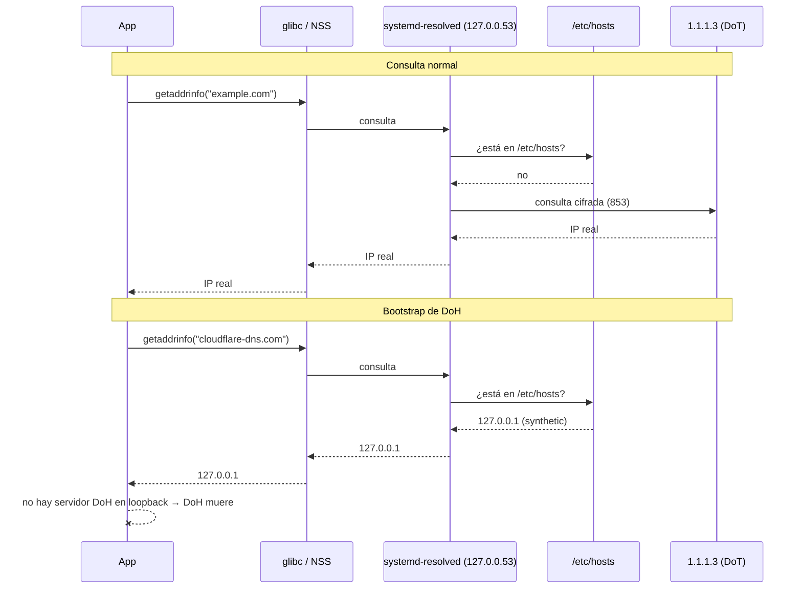

# Flujo DNS

Una consulta normal y el *bootstrap* de DoH, lado a lado.

Lectura: el sinkhole actúa **antes** de que exista cualquier paquete cifrado. No hay que
"ganarle" a TLS: se corta el paso previo.
