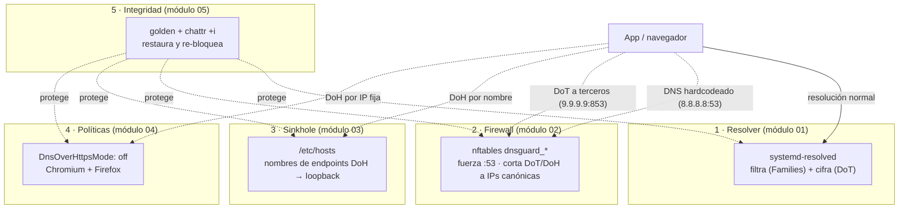

# Capas

Cómo las cinco capas cubren vectores distintos y ninguna alcanza sola.

Lectura: cada flecha punteada es un intento de bypass; la capa a la que llega es la que lo
detiene. La capa 5 no detiene tráfico: protege a las otras cuatro de ser desactivadas.
