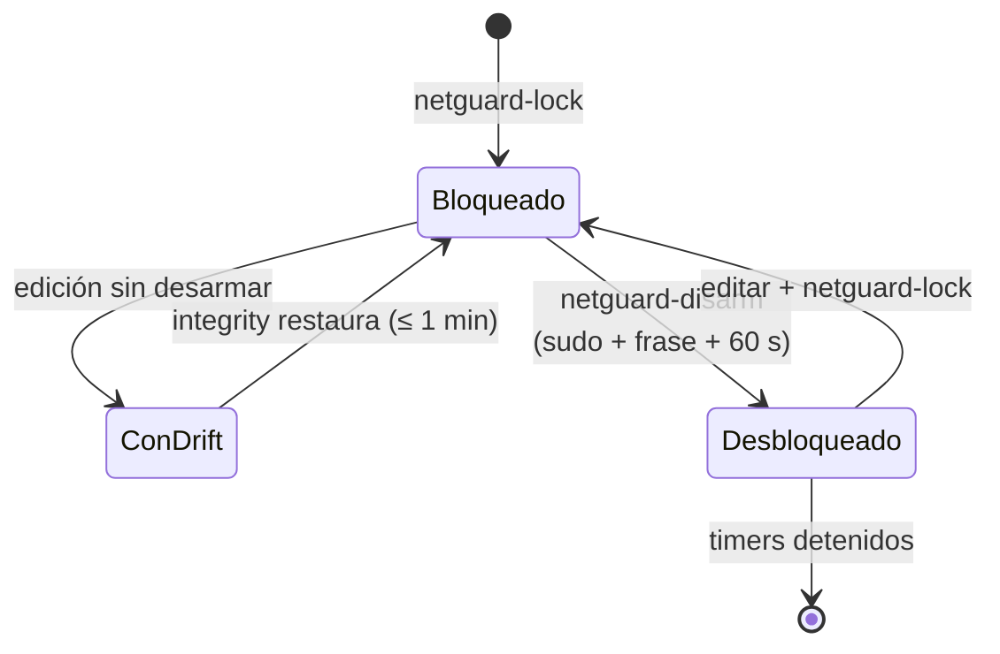
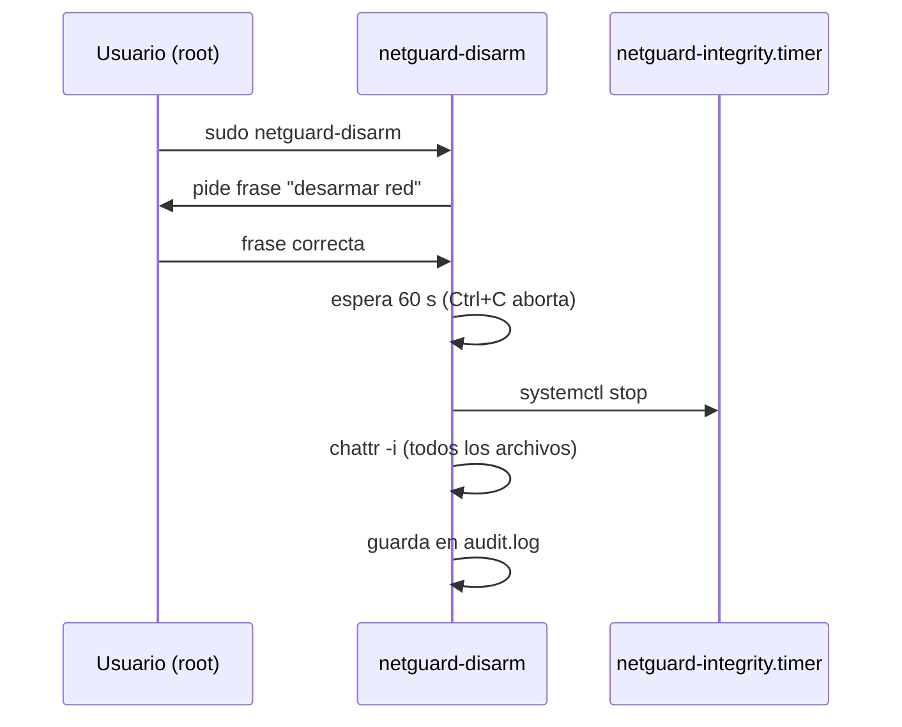

# Ciclo de netguard

Estados de la protección y las transiciones permitidas.

Detalle de la transición de desarme:

Lectura: no hay forma de "saltarse" el desarme sin hacer exactamente lo que hace
`netguard-disarm` (o algo más destructivo y evidente). Así, cada desactivación es
deliberada, lenta y auditada.
